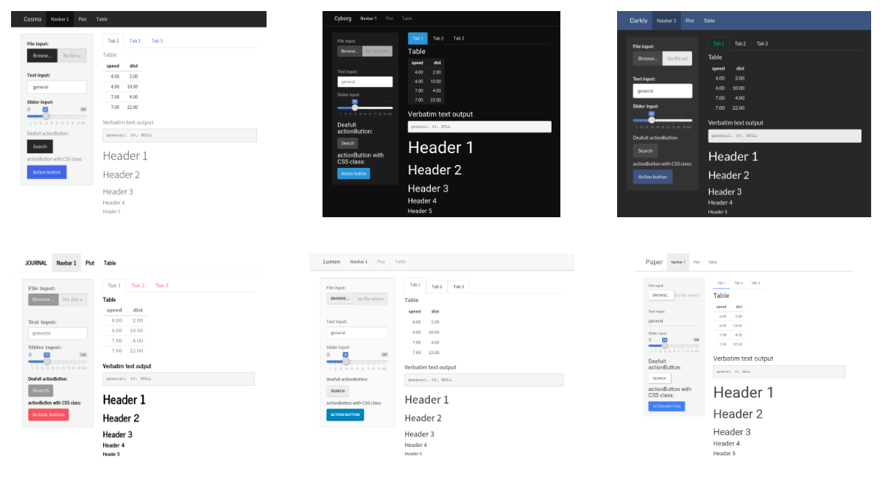

Interaktywne wykresy w R i aplikacjach Shiny
========================================================
author: Krystian Igras
date: 14/12/2017
autosize: true
css: assets/custom.css
font-family: 'lato', Courier, monospace;

Aplikacja Shiny
========================================================

- Czym jest?
- Do czego służy?
- Jakie są jej zalety?

Liczba telefonów na przestrzeni lat według kontynentów
========================================================


Liczba telefonów na przestrzeni lat według kontynentów - wersja Shiny
========================================================
<iframe src="https://krystian8207.shinyapps.io/tel_by_region/" width="100%" height="700" scrolling="no" seamless="seamless" style="border: none"></iframe>

Wydatki na zdrowie a długość życia
========================================================

<iframe src="https://krystian8207.shinyapps.io/google_chart/" width="100%" height="700" scrolling="no" seamless="seamless" style="border: none"></iframe>

Struktura: Serwer <-> UI
========================================================


Konstrukcja
========================================================


```r
server.R
---
  
function(input, output) {
  "Kod wykonujący obliczenia"
}
```


```r
ui.R
---
  
fluidPage(    
  titlePanel("Tytuł"),
  sidebarLayout(      
    sidebarPanel("Elementy wejścia"),
    mainPanel("Elementy wyjścia")
  )
)
```


Komunikacja "serwer - klient"
========================================================

1. Działanie użytkownika.
2. Uruchomienie "zapalnika".
3. Obliczenia serwera.
4. Wysłanie przeliczonego obiektu do UI.
5. Wyświetlenie w UI.

1. Działanie użytkownika
========================================================
class: img-code


```r
ui.R
---
  
selectInput(
  inputID = "region", 
  label = "Region:", 
  choices = c("N.Amer", "Europe", "Asia", "S.Amer", 
              "Oceania", "Africa", "Mid.Amer")
)
```


2. Uruchomienie zapalnika
========================================================


3. Obliczenia serwera
========================================================


4. Wysłanie zaktualizowanego obiektu do UI
========================================================


5. Wyświetlenie w UI
========================================================
class: img-code


```r
ui.R
---
  
plotOutput("phonePlot")
```

Uruchamianie aplikacji
========================================================


Ćwiczenie - nasza pierwsza aplikacja
========================================================


Pomieśćmy więcej informacji!
========================================================

Wykresy interaktywne!
========================================================

Najbardziej popularne biblioteki:

- plotly
- highcharter
- leaflet
- ggvis

Plotly - scatterplot
========================================================


```r
library(plotly)

plot_ly(
  data = iris, 
  x = ~Sepal.Length, 
  y = ~Petal.Length
)
```


Plotly - scatterplot
========================================================

<iframe src="./assets/demo.html" width="100%" height="700" scrolling="no" seamless="seamless" style="border: none"></iframe>

Umiesz w ggplot? Użyj ggplotly!
========================================================


```r
library(ggplot2)

plot_gg <- ggplot(
  data = iris, 
  aes(
    x = Sepal.Length, 
    y = Petal.Length, 
    color = Species)
  ) + 
  geom_point(size = 4, alpha = 0.6) + 
  theme_minimal()

ggplotly(plot_gg)
```

Umiesz w ggplot? Użyj ggplotly!
========================================================

<iframe src="./assets/scatter.html" width="100%" height="700" scrolling="no" seamless="seamless" style="border: none"></iframe>

Dostosujmy tooltip
========================================================


```r
library(ggplot2)

plot_gg <- ggplot(
  data = iris, 
  aes(
    x = Sepal.Length, 
    y = Petal.Length, 
    color = Species, 
    text = paste(
      "Petal.Width", Petal.Width, 
      "\n Sepal.Width", Sepal.Width))
  ) + 
  geom_point(size = 4, alpha = 0.6) + 
  theme_minimal()

ggplotly(plot_gg)
```

Dostosujmy tooltip
========================================================

<iframe src="./assets/tooltip.html" width="100%" height="700" scrolling="no" seamless="seamless" style="border: none"></iframe>

Zapisanie do pliku
========================================================


```r
library(ggplot2)

plot_gg <- ggplot(
  data = iris, 
  aes(
    x = Sepal.Length, 
    y = Petal.Length, 
    color = Species, 
    text = paste(
      "Petal.Width", Petal.Width, 
      "\n Sepal.Width", Sepal.Width))
  ) +
  geom_point(size = 4, alpha = 0.6) + 
  theme_minimal()

plotly_gg <- ggplotly(plot_gg)

htmlwidgets::saveWidget(
  widget = plotly_gg, file = "tooltip.html")
```

Plotly barplot
========================================================


```r
library(plotly)

plot_ly(
  x = c("lwy", "słonie", "małpy"),
  y = c(20, 14, 23),
  name = "Warszawa",
  type = "bar"
)
```


Plotly barplot
========================================================

<iframe src="./assets/bar.html" width="100%" height="700" scrolling="no" seamless="seamless" style="border: none"></iframe>

Plotly barplot - grouped
========================================================


```r
library(plotly)

zoo <- data.frame(
  Animals = c("lwy", "słonie", "małpy"), 
  Warszawa = c(20, 14, 23), 
  Wroclaw = c(12, 18, 29))

plot_ly(
  data = zoo, 
  x = ~Animals, 
  y = ~Warszawa, 
  type = 'bar', 
  name = 'Warszawa'
) %>%
  add_trace(
    y = ~Wroclaw, name = 'Wrocław') %>%
  layout(
    yaxis = list(title = 'Łącznie'),
    xaxis = list(title = 'Zwierzęta'), 
    barmode = 'group')
```


Plotly barplot - grouped
========================================================

<iframe src="./assets/bar_gr.html" width="100%" height="700" scrolling="no" seamless="seamless" style="border: none"></iframe>

Plotly + shiny
========================================================

Funkcja renderująca wykres:

```r
renderPlotly()
```

Funkcja wyświetlająca wykres:

```r
plotlyOutput(
  outputId, 
  width = "100%", 
  height = "400px")
```

Ćwiczenie - telefony z plotly
========================================================


Dostosuj graficznie apkę - shinythemes
========================================================



Dostosuj graficznie apkę - shiny.semantic
========================================================


Dostosuj graficznie apkę - shiny.dashboard
========================================================


The end
========================================================
title: false
</br></br></br>
<center>
**Dziękuję za uwagę!**
</br>
*Pytania?*
</center>

<small>
Źródła:

- https://shiny.rstudio.com/gallery/
- https://plot.ly/r/
- https://rstudio.github.io/shinythemes/
- https://github.com/Appsilon/shiny.semantic
- https://rstudio.github.io/shinydashboard/
</small>
